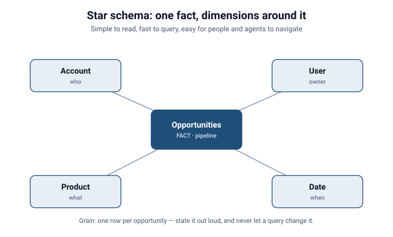
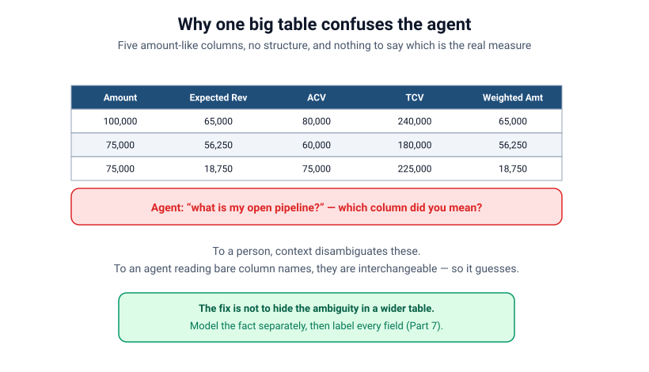
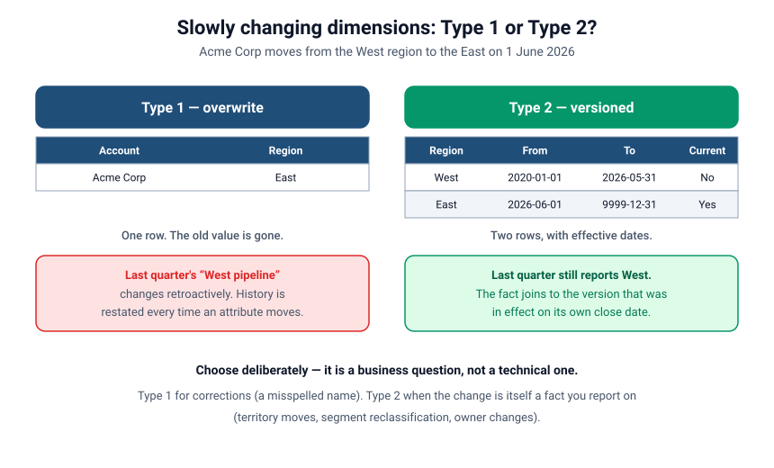

# Facts, Dimensions & the Shape of Your Data
### Part 1 of *Modeling for Answers: Data Modeling Foundations for Tableau Next*

> **Part 1 of 7** · Reading time ~11 minutes
> Every figure in this series is derived from [`data/`](data/) — run `python3 data/verify_numbers.py` to check it.
> Product specifics verified against Tableau Next, API v66.0.

---

## Your tool isn't the problem. Your model's shape is.

If you've built anything on top of a semantic data model — a dashboard, a metric, an
agent that answers questions in plain language — you've probably hit one of these:

- A number that's just… wrong, and you can't explain why.
- A dashboard that crawls, or a browser tab that eats memory until it falls over.
- An AI agent that confidently answers the wrong question.

The instinct is to blame the tool. Nine times out of ten, it isn't the tool. It's the
**shape of the data underneath** — how your tables are defined and how they relate to
each other. Get the shape right and everything above it gets faster, cheaper, and
correct. Get it wrong and no amount of tuning, prompting, or compute will save you.

This series is about getting the shape right. We'll teach the concepts generically —
they apply whether you're in Tableau Next, a tabular model in Power BI, or a warehouse
in Snowflake — and we'll prove each one inside a Tableau Next semantic data model (SDM)
so you can see it working.

Part 1 covers the two building blocks everything else rests on: **facts and dimensions.**

---

## First, clear up the biggest confusion: modeling is not ETL

Here's the single most common misunderstanding we see, and it derails projects before
they start.

**Data modeling is the architect. ETL is the builder.**

- The **architect** decides how the spaces relate, what the building is *for*, and
  whether it will stand up. In data terms, that's modeling: defining what your facts and
  dimensions are, and how entities connect so the data can answer real questions.
- The **builder** physically constructs it — moving materials into place, pouring the
  foundation, laying the brick. In data terms, that's ETL (extract, transform, load):
  moving and shaping data into position.

Both are skilled disciplines, and in practice they iterate together — neither is "above"
the other. But here's why the distinction matters so much:

> A great builder can construct a structurally unsound house from a bad blueprint.

In the same way, a team can be *excellent* at ETL — building clean, well-governed data
products — and still produce a model that answers business questions wrong. We see this
constantly: the pipeline is beautiful, the data is pristine, and the dashboard still lies.
That's not an ETL failure. It's a modeling failure. Flawless construction can't rescue a
bad blueprint.

If your organization has a strong data-engineering practice, that's a gift — but it's the
*builder*. Someone still has to be the architect. Often that someone is the analyst or
admin assembling the semantic model, and they may never have been taught to think like one.
That's what this series is for.

---

## The two building blocks: facts and dimensions

Almost every analytical model is made of just two kinds of things.

**Facts** are the measurable events. They're what you count, sum, and average — the verbs
of your business. An **opportunity** is a fact. So is an order, a support case, a shipment,
a payment. Facts have a *when* (a date), a *how much* (an amount, a quantity), and links to
the context that describes them.

**Dimensions** are the descriptive context you slice facts *by* — the "by what" of every
question. Account, owner/user, product, region, date. When someone asks "pipeline **by
owner** this quarter," *pipeline* comes from a fact and *owner* is a dimension.

A quick test you can apply to almost any object:

| Ask this | If yes… |
|----------|---------|
| Does it record an event with a date and a measure? | It's a **fact** |
| Do you mostly use it to *group or filter* other data? | It's a **dimension** |
| Would two rows describe the *same thing at different points in time*? | Likely a **fact** |
| Is it reused across many analyses purely as context? | It's a **dimension** |
| If you folded it into another table, would it duplicate your measures? | Keep it **separate** |

### A note for Salesforce data specifically

If your data comes out of Salesforce, a few things trip up even experienced modelers —
especially architects who come from a pure warehouse background and don't know the platform:

- **Record types change what an object *means*.** A single "Account" object might hold
  what are really two different business entities — say, a person account and a business
  account. Modeling them as one thing quietly corrupts your analysis.
- **Circular references are everywhere.** User relates to Account relates to Opportunity
  relates back to User. That's natural in Salesforce, but a model has to break those loops
  deliberately or queries get confused.
- **Bundled clouds hide relationships.** The reason teams buy Sales, Service, and industry
  clouds together is precisely so they *don't* have to figure out all the object mappings.
  That convenience means the relationships were never something they had to reason about —
  until now, when they're building a model on top of them.

---

## The shape itself: star, snowflake, and the "one big table" trap

Once you know what your facts and dimensions are, the question is how to arrange them.

**Star schema.** One fact in the center, dimensions arranged around it like points of a
star. Simple to read, fast to query, and easy for both humans and AI agents to navigate.
This is the shape you want most of the time.

**Snowflake schema.** Same idea, but the dimensions are further normalized into
sub-tables (Product → Product Category → Department). More "correct" in a purist sense,
but every extra hop is extra work at query time.

When is that extra hop worth paying for? Three cases, and not many others:

1. **The sub-table is genuinely shared** by several dimensions, and you'd otherwise
   maintain the same category list in three places.
2. **The attribute changes on a different clock** than its parent — product categories get
   restructured quarterly while products themselves are stable — so versioning them
   separately is cheaper than versioning the whole dimension.
3. **The dimension is enormous and the attribute is sparse.** A million-row customer
   dimension with a rarely-used 40-column demographic block is a reasonable snowflake.

Outside those, denormalize the dimension and take the width. A wide dimension is cheap;
an extra join on every query is not.

**The "one big table" trap.** The tempting shortcut: flatten *everything* — facts and all
their dimensions — into a single wide table, and let the tool (or the agent) "figure it
out." Cheap storage and cheap compute made this feel harmless, and a generation of data
practitioners stopped thinking about modeling at all.

It isn't harmless. A single wide table causes two specific problems:

1. **It explodes on relationships.** The moment one row relates to many (one opportunity,
   many line items), flattening duplicates your measures. In our sample data, a $100,000
   opportunity with three line items reads as **$300,000** — we'll watch that happen in
   Part 3.
2. **It confuses the agent.** Hand an AI agent five similarly-named amount columns with no
   structure and it has to *guess* which one you meant. It will guess wrong often enough
   that you can't rely on the answers — and it'll do it confidently.

A clean fact-and-dimension shape isn't academic tidiness. It's what makes your dashboards
correct and your agent trustworthy.

---

## Sidebar: dimensions change, and you have to decide what that does to history

Here's a question that looks like a technical detail and is actually a business decision.

Acme Corp is in the West region. On 1 June, it moves to the East. What should last
quarter's "West region pipeline" report say next week?

There are two honest answers, and they have names.

**Type 1 — overwrite.** You update the region to East and move on. One row, always
current. The consequence: last quarter's West pipeline number *changes retroactively*,
because the model now believes Acme was always in the East. Every historical report shifts
every time an attribute moves.

**Type 2 — versioned.** You keep the old row, close it off with an effective-to date, and
add a new row for East. Now the dimension has two rows for Acme, and each fact joins to
whichever version was in effect on its own close date. Last quarter still reports West,
because that's what was true at the time.

These are **slowly changing dimensions**, and choosing between them is not a preference —
it depends on what the change *means*:

- **Type 1 for corrections.** A misspelled account name, a bad postcode, a data-entry
  fix. There was never a period when the old value was true, so preserving it is noise.
- **Type 2 when the change is itself a fact you report on.** Territory moves, segment
  reclassifications, owner changes, price-book revisions. Someone will eventually ask
  "how did the West do last year," and they mean the West as it was.

The trap is defaulting to Type 1 because it's simpler, then discovering in a board meeting
that a number you published three months ago no longer reproduces. If you can't
confidently say which type each dimension uses, that's the first thing to go and check.

There are further types — Type 0, 3, 4 and hybrids — and they matter less often.
[`reference/going-deeper.md`](reference/going-deeper.md) covers them.

---

## Sidebar: Date is a real table, not a formatting concern

Look at the star diagram again. Three of the dimensions are obviously tables: Account,
User, Product. The fourth one — **Date** — is the one people skip, because every fact
already has a date column in it. Why build a table for something you already have?

Because a raw date column can only tell you what day it was. A **date dimension** — a real
table with one row per day — tells you everything you actually want to group by:

- calendar year, quarter, month, week
- **fiscal** year, quarter and period, which are usually *not* the calendar ones
- flags like "is this in the current fiscal year to date"
- holidays, working days, period-end markers

Our sample calendar table ([`data/calendar.csv`](data/calendar.csv)) runs from October 2025
to January 2027 and carries both calendar and fiscal attributes, with a fiscal year
starting 1 February.

That one decision — fiscal year starts in February — is why "how are we doing this year?"
has two correct answers in our data: **$600,000** of bookings on the calendar year and
**$480,000** on the fiscal year. A $120,000 gap, caused by a single order placed in January.
We'll detonate that in Part 7, where an agent has to answer the question without being told
which calendar to use.

Materialize the calendar table once, upstream, in the builder's territory. It is the
cheapest table you will ever build and it removes a whole category of argument.

---

## Seeing it in a Tableau Next semantic data model

Let's make it concrete. We'll build one model and carry it through the whole series.

We start with a single fact: **Opportunities** — your pipeline, your future sales. Around
it we place the dimensions that describe each opportunity: **Account** (who), **User** (the
owner), **Product** (what), and **Date** (when). On the SDM canvas, that's a textbook star:
Opportunities in the middle, four dimensions radiating out.

The objects, relationships and field descriptions are described as we go; the questions that prove
the model behaves correctly are collected in
[`Semantic Models/agent-eval-set.md`](Semantic%20Models/agent-eval-set.md).

Notice what we did **not** do: we didn't cram everything into one table. That discipline
pays off in Parts 3 and 4, when we add a second fact — **Orders**, your historical actuals —
and compare pipeline against what actually sold. That's where a whole new class of question
opens up: which accounts are buying (Orders) but have nothing in the pipeline
(Opportunities)? Which products sell but never get forecast? That's your **whitespace and
cross-sell** view — and it's only possible because we kept the two facts as separate,
well-shaped facts instead of one flat blob.

---

## The failure, live

Here's the demo worth remembering. Take the same underlying data, but load it as one
denormalized wide table. Ask the agent a simple question: *"What's my open pipeline by
owner this quarter?"*

With the wide table, the agent has several plausible amount columns and no structural cue
about which is the real pipeline measure or how "owner" relates to it. It picks one, joins
loosely, and returns a number that's ambiguous at best and inflated at worst.

Now ask the exact same question against the modeled star. Opportunities is unambiguously
the fact, `Amount` is unambiguously the measure, User is unambiguously the owner dimension.
The agent returns a clean, correct answer — **$250,000** of open pipeline, which you can
check yourself against `data/opportunities.csv` — because the shape told it what everything
is.

Same data. Same question. Same agent. The only variable was the model's shape.

---

## Takeaways: is it a fact or a dimension?

Before you build anything, run each object through this five-point check:

1. Does it record an **event** with a date and a measure? → fact.
2. Do you mostly use it to **group or filter** other data? → dimension.
3. Could two rows describe the **same thing at different times**? → likely a fact.
4. Is it **reused as context** across many analyses? → dimension.
5. Would folding it in **duplicate measures**? → keep it separate.

Then two decisions people forget to make:

6. For each dimension, is it **Type 1 or Type 2**? Decide it before someone asks you to
   reproduce last quarter.
7. Do you have a real **date dimension** with fiscal periods in it? If not, "this year" is
   an argument waiting to happen.

And remember the frame: **model like an architect, build like a builder.** A flawless
build on a bad blueprint still falls down.

Practice questions for this part are in
[`reference/exercises.md`](reference/exercises.md).

---

## Coming next

**[Part 2 — Relationships vs. Joins](session-2-relationships-vs-joins.md).** You applied a
filter and the number didn't change. Why? Because a semantic relationship is not the same
as a traditional join, and queries are *economical* — they won't travel to an object unless
something forces them to. We'll show you exactly how that trips people up, and how to fix
it.

*Have a modeling war story or a question you want us to cover? Tell us — this series takes
shape from the questions we hear most.*
