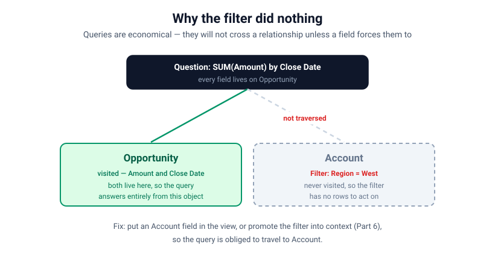
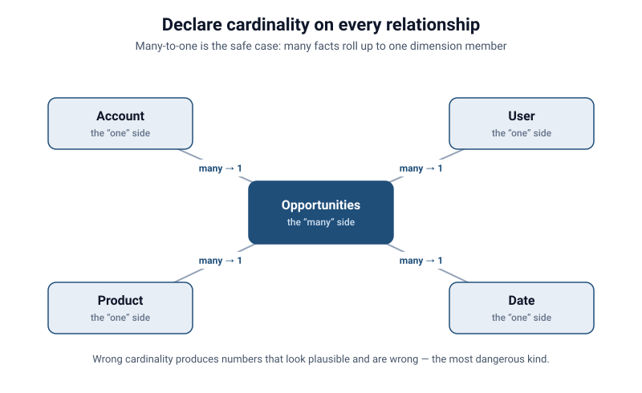
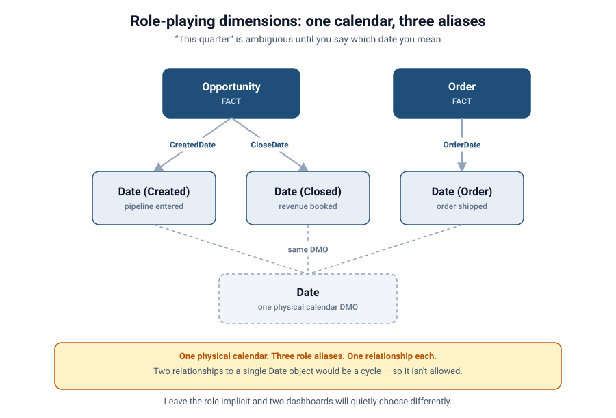
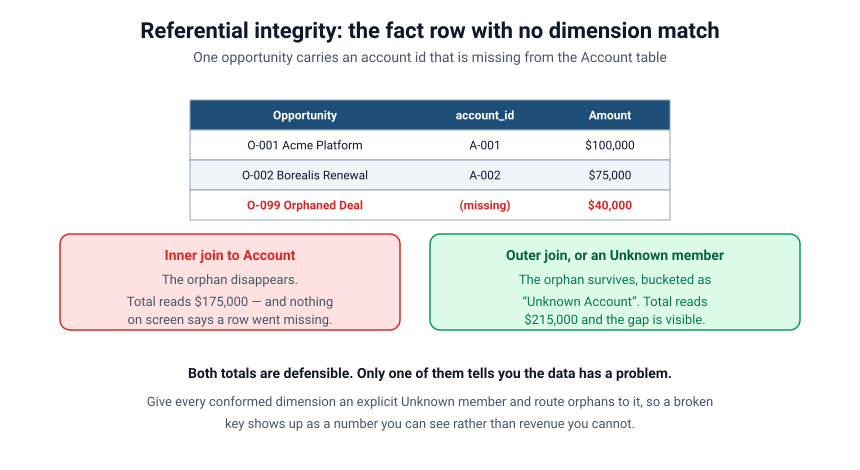

# Relationships vs. Joins
### Part 2 of *Modeling for Answers: Data Modeling Foundations for Tableau Next*

> **Part 2 of 7** · Reading time ~13 minutes
> Every figure in this series is derived from [`data/`](data/) — run `python3 data/verify_numbers.py` to check it.
> Product specifics verified against Tableau Next, API v66.0.

---

## You applied a filter. The number didn't move.

Here's a bug report we get almost every week, in some form:

> "I added a filter for *Region = West* and my total pipeline didn't change at all. The
> filter is clearly on the canvas. Is it broken?"

The filter isn't broken. The tool isn't broken. What happened is that the query never
actually *visited* the object your filter lives on — so there was nothing for the filter
to do. To understand why that happens (and why it's not a bug), you have to understand the
single most misunderstood idea in modern semantic modeling:

**A relationship is not a join.**

In Part 1 we got the *shape* right — facts in the middle, dimensions around them. Part 2 is
about the *connections* between them, and why the way you declare a connection changes
whether your filters, your totals, and your agent's answers are correct.

---

## A join and a relationship are not the same thing

They feel like synonyms. They are not. They behave differently, they cost differently, and
they fail differently.

**A traditional join is a physical instruction.** When you write a join, you are telling the
engine: *"Go combine these two tables on this key, right now, and hand me back the merged
rows."* It's eager. It happens whether or not you end up using a single column from the
second table. And critically — it changes the *grain* of your data the moment the
relationship is one-to-many. Join Opportunity to its many line items and you no longer have
one row per opportunity; you have one row per line item, with the opportunity's amount
copied onto every one of them. (That's fan-out, and it's the whole subject of Part 3.)

**A semantic relationship is a declared possibility.** When you draw a relationship in a
semantic data model, you are not saying "combine these now." You're saying: *"These two
objects are related, on this key, with this cardinality. Travel between them **when a
question requires it**."* It's a description of how the model *can* be traversed — not an
instruction to traverse it immediately.

Think of it as the difference between **welding two rooms into one** (a join — permanent,
and now everything in one room is duplicated across the other) versus **putting a door
between them** (a relationship — they stay separate rooms, and you only walk through the
door when you actually need something on the other side).

---

## Economical queries: the engine only travels when it has a reason

This is the mental model to internalize, and it's the one that explains the "my filter did
nothing" mystery:

> **Queries are economical. The engine will not travel across a relationship unless a field
> in your question forces it to.**

If you build a viz that only references fields from the **Opportunity** fact — say, `SUM(Amount)`
grouped by `Close Date` — the query planner looks at what you asked for, sees that everything
it needs lives on Opportunity, and *never leaves that object*. It doesn't touch Account. It
doesn't touch User. Why would it? Traversing a relationship costs time and memory, and a good
engine doesn't pay costs it doesn't have to.

This is a feature. It's what keeps semantic models fast: the same rich model with twelve
related objects stays cheap to query because any given question only pulls in the handful of
objects it actually mentions. A join-everything-up-front world can't do that — it pays for
every table on every query.

But economy has a sharp edge, and here it is.

---

## Why your filter silently did nothing

Go back to the bug report. You filtered on **Region**, and Region is an attribute of the
**Account** object. But your viz only showed `SUM(Amount)` — a field on **Opportunity**.

The engine looked at your measure, saw it could answer entirely from Opportunity, and never
traveled to Account. Your Region filter was sitting on a room the query never entered. It
wasn't ignored maliciously; it was **irrelevant to the path the query took**, so it applied
to nothing.

This is the number-one "silent no-op" in semantic modeling, and it shows up in three flavors:

1. **The filter is on an unvisited object.** As above — the query didn't traverse to the
   object the filter lives on, so the filter had no rows to act on.
2. **The relationship direction doesn't propagate the filter.** More on this in a moment;
   it's the flavour people find most surprising.
3. **The cardinality is declared wrong,** so the engine either refuses to traverse or
   traverses the wrong way.

The fix is almost always one of two things: **(a)** bring a field from the target object
into the question so the query is forced to travel there, or **(b)** promote the filter into
*context* so the engine evaluates it as a constraint on the whole query rather than a
last-mile filter on rows it never fetched. (Context is important enough that Part 6 is
devoted to it.)

---

## Which way does a filter actually flow?

"Filters propagate in a direction" is the sort of sentence that sounds like an explanation
and isn't. Here is the actual mechanism.

Filtering flows **from the "one" side to the "many" side by default.** That direction is the
one that's always safe, because it can only ever *remove* rows:

- Filter **Account** to `Region = West`, and the Opportunities fact narrows to the
  opportunities belonging to those accounts. One account, many opportunities — the filter
  fans *outward* to the many side, unambiguously.
- Filter **Opportunity** to `Amount > 100000`, and Account does **not** narrow by default.
  The engine has no obligation to work out which accounts survive, and if you're only
  displaying opportunity fields it has no reason to.

That default is called **single-direction** filtering, and it's the right one almost always.
The tempting alternative is **bidirectional** filtering, where a filter on the many side
also narrows the one side. Some platforms let you enable it per relationship. It solves a
real problem and introduces two worse ones:

- **Ambiguity.** With two facts hanging off a shared dimension and filters flowing both
  ways, there can be more than one path a filter could take, and the result depends on which
  one the engine picks. That's how two structurally identical dashboards return different
  numbers.
- **Loops.** Our Part 1 warning about circular references becomes live here. User → Account
  → Opportunity → Owner (User) is a cycle. Single-direction filtering breaks it naturally.
  Turn on bidirectional filtering and the engine can chase its own tail.

The discipline: **leave filtering single-direction, and when you need a filter to reach
somewhere it doesn't reach, put a field from the target object into the question or promote
the filter into context.** Reach for bidirectional filtering last, on one specific
relationship, for a reason you can write down.

And one thing filters never do on their own: **a filter on one fact does not narrow a second
fact.** Filter Opportunities to the West and your Orders total does not move, because there
is no relationship between the two facts — only a shared dimension between them. Making the
two agree is drill-across, and that's Part 4.

---

## Cardinality: the most important thing you declare

When you draw a relationship, the platform asks you — implicitly or explicitly — *how many
of A relate to how many of B?* This is **cardinality**, and getting it wrong is how correct
data produces incorrect totals.

- **Many-to-one** (many Opportunities → one Account): the safe, common case. Many facts roll
  up to one dimension member. Aggregations behave.
- **One-to-many** (one Opportunity → many Line Items): traversing this *multiplies* the
  "one" side. Sum a header amount across its children and you've triple-counted it.
- **Many-to-many** (Opportunities ↔ Products): can't be expressed directly and correctly
  without a bridge object in between. (Part 4.)

Declaring cardinality isn't bureaucratic box-ticking. It's you telling the engine how to
aggregate safely across the relationship — whether it needs to de-duplicate, how to avoid
inflating the "one" side, and which direction filters may flow. A model with sloppy
cardinality produces numbers that look plausible and are wrong, which is the most dangerous
kind of wrong.

---

## Sidebar: the same dimension, related three times

Our star has one Date dimension. But an opportunity has a **created date** and a **close
date**, and an order has an **order date**. All three are dates. Do you build three date
tables?

No. You build one and relate to it three times. Each relationship is a **role**, and this
pattern is a **role-playing dimension**.

The reason this matters is that it makes "this quarter" a question rather than a fact.
Pipeline generated this quarter means *created* this quarter. Bookings this quarter means
*closed* this quarter. Those are different sets of opportunities, and both are legitimate
readings of "this quarter's pipeline."

Two consequences worth internalizing:

- **Name the role, not the table.** In the model, the relationships should read as
  `Opportunity.Close Date → Date` and `Opportunity.Created Date → Date`, and the fields
  users see should say "Close Date" and "Created Date" — never a single ambiguous "Date."
- **Pick the default deliberately.** Pipeline and forecast metrics usually key off created
  date; revenue and bookings metrics off close date. Write the choice into the metric
  definition so it travels with the number (Part 5), rather than leaving each analyst to
  rediscover it.

Leave the role implicit and two dashboards will quietly choose differently — which is the
Part 6 argument in miniature.

---

## Sidebar: what happens to a fact row whose dimension key doesn't match?

Relationships assume the key on the fact side actually exists on the dimension side. Real
data disagrees. A deal gets created against an account that was later merged and deleted; a
nightly load brings in orders before the accounts that own them; an integration writes a
blank.

That fact row is an **orphan**, and what your model does with it decides whether you notice.

- **Inner semantics** discard the orphan. Your total gets quietly smaller. Nothing on screen
  says a row went missing — this is the most dangerous outcome, because the dashboard looks
  perfectly healthy.
- **Outer semantics** keep the orphan with nulls on the dimension side. The total is right,
  but the row shows up under a blank or "null" label that people learn to ignore.
- **An explicit Unknown member** is the pattern worth adopting. Give every conformed
  dimension a real row — `A-000 / "Unknown Account"` — and route orphans to it in the
  builder. Now the total is right *and* the gap has a name, a number, and somewhere to
  appear on a data-quality dashboard.

The rule of thumb: **referential integrity is something you assert and then verify, not
something you assume.** A row count on the fact table that doesn't match the row count after
joining to a dimension is the cheapest data-quality test you will ever write.

---

## A note for Salesforce data specifically

- **Lookup vs. master-detail relationships carry cardinality hints — but not answers.** The
  Salesforce relationship type tells you something about how records are linked
  operationally; it does *not* automatically tell your semantic model the analytical
  cardinality or the safe traversal direction. You still have to declare intent.
- **Optional lookups are orphan factories.** A nullable lookup means the fact row can
  legitimately have no parent. Decide up front whether those rows belong in your totals.
- **Circular references (from Part 1) become traversal traps here.** User → Account →
  Opportunity → Owner (User) is a loop. Break it deliberately: pick the one path each
  question should take.
- **Formula and roll-up fields hide joins.** A Salesforce roll-up summary field already did a
  join upstream. If you then relate and aggregate it again in the semantic layer, you can
  double-apply the same relationship without realizing it.

---

## Seeing it in a Tableau Next semantic data model

Back to our spine model from Part 1: **Opportunities** in the center, with **Account**,
**User**, **Product**, and **Date** related around it.

On the SDM canvas, each of those connectors is a *relationship*, not a baked-in join. That's
what lets one model serve wildly different questions cheaply: "pipeline by close month" never
leaves Opportunity; "pipeline by account region" travels one hop to Account; "pipeline by
owner's role" travels one hop to User. Each question pays only for the doors it walks through.

Now set up the trap deliberately. In our sample data, total opportunity value across all
stages is **$1,250,000**. Four accounts sit in the West region, and the three of them that
carry opportunities — Acme Corp, Borealis Ltd and Fjord Logistics — account for **$675,000**
of that. Build a viz with only `SUM(Amount)` by `Close Date`, then add a filter on
`Account.Region = West`.

The total stays at $1,250,000. It does not move to $675,000, because the query never went to
Account.

---

## The failure, live

Here's the demo worth remembering.

1. **Show the no-op.** Pipeline by close month, filter to *Region = West*. Total stays
   $1,250,000. Let it sit for a second — the room reads as "the filter is broken."
2. **Explain the economy.** Point at the viz: every field here lives on Opportunity. The
   query had no reason to travel to Account, so it didn't, and your Region filter had nothing
   to filter.
3. **Force the door open.** Add `Account.Region` to the view (as a column, or the filter to
   context). Now the query *must* travel to Account — and the number snaps to $675,000.

Same model. Same filter. The only thing that changed was whether the question gave the engine
a reason to walk through the door.

---

## Takeaways: think in doors, not welds

1. **A join welds tables together now; a relationship is a door you walk through only when
   asked.** Prefer relationships and let the engine stay economical.
2. **If a filter "does nothing," ask: did the query even visit that object?** Usually it
   didn't. Reference a field from that object, or push the filter into context.
3. **Declare cardinality on purpose.** Many-to-one is safe; one-to-many multiplies;
   many-to-many needs a bridge. Wrong cardinality = confident wrong totals.
4. **Filters flow from the "one" side to the "many" side.** Leave it single-direction. Reach
   for bidirectional filtering last, on one relationship, for a written-down reason.
5. **One fact never narrows another.** Only a shared dimension connects them, and making
   them agree is drill-across (Part 4).
6. **Name the role, not the table.** Close Date and Created Date are different questions.
7. **Give every dimension an Unknown member** and route orphans to it, so a broken key
   becomes a number you can see rather than revenue you can't.

And the frame from Part 1 still holds: you're the architect. Relationships are how you decide
which rooms connect, and the query engine is a very economical builder who won't take a single
extra step you didn't ask for.

Practice questions for this part are in
[`reference/exercises.md`](reference/exercises.md).

---

## Coming next

**[Part 3 — Grain, Fan-out & the Chasm Trap](session-3-grain-fan-out-and-the-chasm-trap.md).**
So far we've had one fact. Now we add **Orders** — your historical actuals — alongside
**Opportunities**. The moment two facts share a dimension, naive joins start *duplicating
revenue* and blowing up row counts. We'll define grain properly, watch a $100,000 deal read
as $300,000, and meet the trap that inflates bookings by 2.08× while silently deleting two
accounts.

*Hit the "filter that did nothing" problem yourself? Tell us how you found it — we're
collecting the best war stories for the webinar.*
