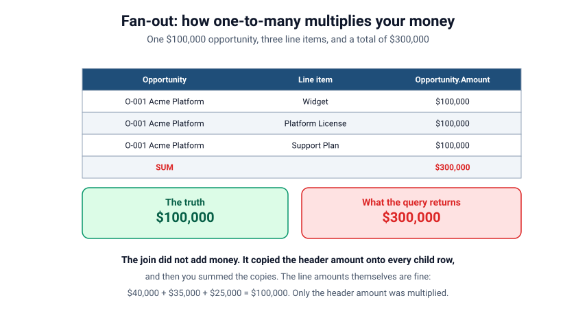
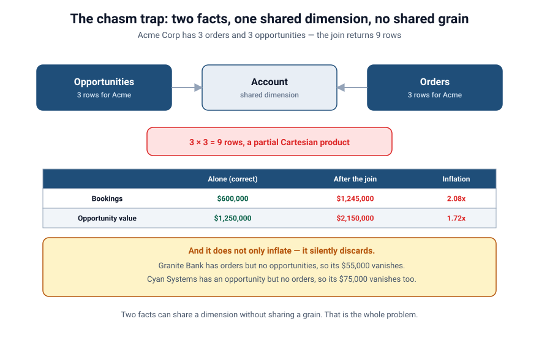

# Grain, Fan-out & the Chasm Trap
### Part 3 of *Modeling for Answers: Data Modeling Foundations for Tableau Next*

> **Part 3 of 7** · Reading time ~12 minutes
> Every figure in this series is derived from [`data/`](data/) — run `python3 data/verify_numbers.py` to check it.
> Product specifics verified against Tableau Next, API v66.0.

---

## The day your revenue doubled (and nothing was wrong with your data)

You've been running the series' spine model — **Opportunities** and its dimensions — and it's
been clean. Then a stakeholder asks the obvious next question:

> "Show me pipeline *and* actual bookings by account, side by side."

So you bring in a second fact — **Orders**, your historical actuals — relate it to the same
**Account** dimension, drop both measures on a table, and… your bookings total reads
**$1,245,000** when finance says **$600,000**. Nobody typo'd anything. Every row in every
source is correct. And the number is still wrong — by a factor of 2.08.

Welcome to what happens when **two facts collide**. This is the part of modeling that
separates "I drew some boxes and lines" from "I built something that gives correct answers,"
and it rests on one idea we've mentioned but not yet made central: **grain**.

---

## Grain: the question you must answer before anything else

**Grain is what one row means.** Not what's in the table — what a single row *represents*.

In our sample model, four tables, four different grains:

| Table | One row means | Rows |
|-------|---------------|------|
| `opportunities` | one opportunity | 11 |
| `opportunity_line_items` | one product on one opportunity | 16 |
| `orders` | one order | 9 |
| `order_lines` | one product on one order | 11 |

Every correctness problem in this article traces back to mixing those grains without meaning
to. When you combine data, you are combining rows — and if two datasets count *different
things per row*, adding them together is a category error dressed up as arithmetic.

The discipline is almost embarrassingly simple: **state the grain of every fact out loud, in
the form "one row per ___", and never let a query change it silently.** Write it in the
object's description in the model so it travels with the table. It's the single most
clarifying sentence in data modeling, and most models don't contain it anywhere.

Two corollaries worth knowing:

- **A measure belongs to exactly one grain.** `Opportunity.Amount` is an opportunity-grain
  measure. `OpportunityLineItem.Line Amount` is a line-grain measure. They are not
  interchangeable and they must not be summed together.
- **Changing grain is a deliberate act.** Aggregating from line grain up to opportunity
  grain is fine. Letting a join push opportunity-grain data *down* to line grain, without
  saying so, is where the money multiplies.

---

## Fan-out: how one-to-many multiplies your money

We met fan-out in Part 2. Now let's watch it inflate a real number.

Opportunity **O-001, "Acme Platform Expansion"**, has an `Amount` of $100,000. It has
**three** line items. Relate Opportunity to Opportunity Line Item and query
`SUM(Opportunity.Amount)`:

| Opportunity | Line item | Opportunity.Amount (repeated) |
|-------------|-----------|-------------------------------|
| O-001 Acme Platform Expansion | Widget | $100,000 |
| O-001 Acme Platform Expansion | Platform License | $100,000 |
| O-001 Acme Platform Expansion | Support Plan | $100,000 |
| **Sum** | | **$300,000** ❌ |

The join didn't *add* money. It **copied the header amount onto every child row**, and then
you summed the copies. This is **fan-out**: traversing a one-to-many relationship multiplies
the "one" side by the count of the "many" side. Your $100K deal now reads as $300K, and it
does it quietly, on a table that looks completely reasonable.

The detail that makes this so hard to spot: **the line amounts themselves are perfectly
fine.** Those three line items are $40,000, $35,000 and $25,000, and they sum to exactly
$100,000. Nothing is corrupt. The only broken thing is which measure got multiplied.

A well-built semantic layer can protect you here *if the cardinality is declared correctly*
(Part 2) — it knows `Opportunity.Amount` lives at the opportunity grain and shouldn't be
multiplied by line items. But the instant you flatten to one wide table (Part 1), you throw
that protection away: now the amount physically repeats on every row and no engine can tell
the copies from the original.

---

## Two classic traps, by name

Dimensional modelers have names for the two ways facts collide. Knowing the names helps you
see them coming.

**The fan trap** — a one-to-many relationship where you aggregate a measure from the "one"
side after traversing to the "many" side. Account → Opportunity → Line Item is a chain of
them; aggregate a measure from the top and it fans out by everything below. That's the $300K
deal above.

**The chasm trap** — the one that inflated your bookings. Two facts hang off the *same shared
dimension* (Orders → Account ← Opportunities). Query both facts together, grouped by Account,
and the engine tries to line them up through Account. But there's no real row-to-row
correspondence between orders and opportunities — so it produces a **partial Cartesian
product**: every order for an account gets paired with every opportunity for that account.

> **A note on the names.** This terminology is not perfectly standardized. "Fan trap" and
> "chasm trap" come out of the BusinessObjects universe-design tradition and are used
> slightly differently by different vendors and authors; Kimball tends to describe the same
> failures in terms of grain and multi-valued dimensions rather than naming the traps.
> Tableau's own documentation uses the terms broadly as we do here. If you read a definition
> elsewhere that draws the line in a different place, you aren't misunderstanding it — the
> field genuinely disagrees. What matters is the mechanism, not the label.
> [`reference/going-deeper.md`](reference/going-deeper.md) has more on the variations.

---

## Watching the chasm trap eat $645,000

Let's put real numbers on it. Take Acme Corp, which in our data has **3 orders** and **3
opportunities**. Join them through Account and you get 3 × 3 = **9 rows** for that one
account. Across the whole model, the naive join produces **18 rows** where there should be
9 orders and 11 opportunities.

Here's what that does to both totals:

| Measure | Queried alone (correct) | After the naive join | Inflation |
|---------|------------------------|----------------------|-----------|
| Bookings | $600,000 | $1,245,000 | **2.08×** |
| Opportunity value | $1,250,000 | $2,150,000 | **1.72×** |

Notice that the two facts inflate by **different factors**. That's characteristic, and it's
why the bug is so confusing in practice: one number is twice too big, the other is not quite
twice too big, and no single "divide by two" correction fixes the table.

Then there's the part nobody warns you about. **The naive join doesn't only inflate — it
silently deletes.**

- **Granite Bank** has an order for **$55,000** and no opportunities at all. An inner join
  needs a match on both sides, so Granite Bank vanishes from the result entirely.
- **Cyan Systems** has a **$75,000** opportunity and no order history. It vanishes too.

So the query simultaneously overstates the accounts that appear and omits the ones that
don't. Those two omitted accounts are not edge cases to be tidied up later — as we'll see in
Part 4, **they are the most commercially interesting rows in the entire dataset.** One is a
customer who has stopped buying. The other is a net-new logo. The naive join throws away
exactly the rows you'd want to act on.

The chasm trap is *the* reason "just relate the second fact to the same dimension and put both
measures on one table" fails. The facts share a dimension; they do **not** share a grain.

---

## How to recognize it in the wild

You will not always have a clean $600,000 to compare against. Four tells:

1. **A total is 2–3× too big and won't reconcile to the source system.** Suspect fan-out
   (one path) or a chasm trap (two facts, one shared dimension).
2. **Two measures on the same table are wrong by different multiples.** Almost diagnostic of
   a chasm trap.
3. **Row counts explode when you add a second fact to a view.** Drop a unique row identifier
   into the view and count it — if `COUNTD(Opportunity Id)` is 11 but the row count is 18,
   you've found your Cartesian product.
4. **Removing one field fixes the number.** If deleting a column from the view makes the
   total correct, that column was forcing a traversal you didn't want.

The fastest check of all: **query each fact on its own and write the numbers down.** If
Orders alone says $600,000 and Orders-next-to-Opportunities says $1,245,000, the model isn't
disagreeing with itself — the second query is answering a different, wrong question.

---

## The failure, live

1. **Collide them naively.** Relate Orders to Account, drop `SUM(Order.Amount)` and
   `SUM(Opportunity.Amount)` by Account on one table. Bookings reads $1,245,000 against
   finance's $600,000. Let the room feel the "wait, that can't be right."
2. **Show the row explosion.** Filter to Acme Corp alone and put a row count on it: 9 rows
   for 3 orders. Then point out that the two measures are inflated by *different* factors,
   2.08× and 1.72×, so there's no single fudge factor that rescues the table.
3. **Name the trap.** Two facts, one shared dimension, no shared grain → every order paired
   with every opportunity → double counting.
4. **Show the deletion.** Search the result for Granite Bank and Cyan Systems. They're gone.
   $130,000 of the most actionable data in the model, silently absent.

Same two facts. The only variable was whether the query respected their grains.

---

## Takeaways: before you add a second fact

1. **State the grain of every fact out loud** — "one row per ___" — and put it in the object
   description so it travels with the table.
2. **A measure belongs to exactly one grain.** Header amounts and line amounts are different
   measures and must never be summed together.
3. **One-to-many multiplies.** If a total looks 2–3× too big, suspect fan-out (one path) or a
   chasm trap (two facts, shared dimension).
4. **Two measures wrong by different factors is the chasm trap's signature.** There's no
   single correction that fixes it, because it isn't one error.
5. **The naive join deletes as well as inflates.** Accounts present in only one fact
   disappear — and those are usually the interesting ones.
6. **Query each fact alone first.** Write down the true totals before you combine anything.
   Those numbers are your regression test.

Practice questions for this part are in
[`reference/exercises.md`](reference/exercises.md).

---

## Coming next

**[Part 4 — Conformed Dimensions, Junctions & the Whitespace Payoff](session-4-conformed-dimensions-junctions-whitespace.md).**
We've broken it; now we fix it. Conformed dimensions and drill-across let each fact stay at
its own grain while still lining up side by side — and the join type at the end turns out to
be the whole ballgame. Then junction objects for honest many-to-many, the allocation factor
that stops "revenue by product" exceeding total revenue, and the payoff the whole series has
been building toward: a whitespace and cross-sell view you cannot construct from a flat
table.

*Got a "revenue doubled and I can't explain it" story? Send it — collision bugs are the best
teaching examples we have.*
