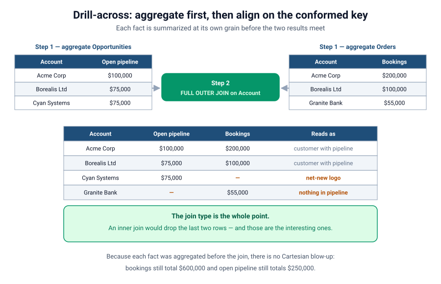
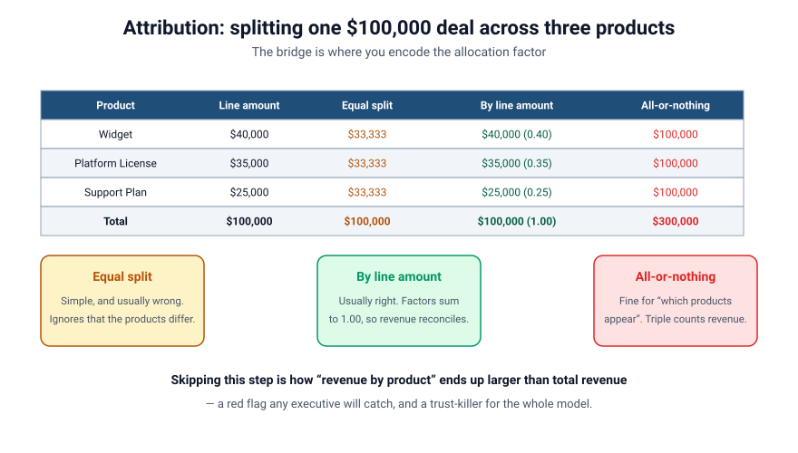
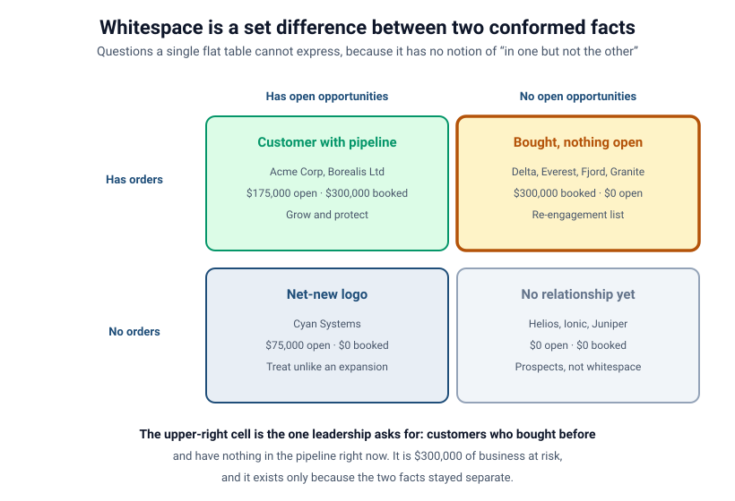

# Conformed Dimensions, Junctions & the Whitespace Payoff
### Part 4 of *Modeling for Answers: Data Modeling Foundations for Tableau Next*

> **Part 4 of 7** · Reading time ~13 minutes
> Every figure in this series is derived from [`data/`](data/) — run `python3 data/verify_numbers.py` to check it.
> Product specifics verified against Tableau Next, API v66.0.

---

## You don't fix colliding facts by welding them together

Part 3 left us with a broken table: bookings inflated 2.08× to $1,245,000, opportunity value
inflated 1.72× to $2,150,000, and two accounts worth $130,000 silently deleted from the
result.

The instinct at this point is to reach for something more forceful — a bigger join, a
`DISTINCT`, a de-duplicating calculation stapled on top. All of those are attempts to repair
a query that was asking the wrong question.

The actual fix is to stop trying to line the two facts up row by row. They don't correspond
row by row. What they share is **context**, not rows. So you give them shared context, let
each one stay at its own grain, and combine them only after each has been summarized.

That's this part. And it ends with the thing the whole series has been building toward.

---

## Conformed dimensions: defined once, used identically

A **conformed dimension** is a dimension defined *once* and used *identically* by multiple
facts. Both Opportunities and Orders point at the **same** Account dimension, the **same**
Product dimension, the **same** Date dimension — same keys, same members, same meaning. A
"West region" account is the same entity to both facts, and `A-001` means Acme Corp
everywhere.

That sounds obvious until you see how it usually fails. Conformance breaks in three ordinary
ways:

- **Different keys.** Opportunities carry a Salesforce account id; Orders arrived from an ERP
  and carry a customer number. Until something reconciles them, the two facts are pointing at
  two different dimensions that happen to have similar names.
- **Different grain in the dimension.** One fact relates to Account; the other relates to
  Account *Site* or a billing sub-account. Now "by account" means two different groupings.
- **Different membership.** The Account dimension only contains accounts with opportunities.
  Orders belonging to anyone else fall off the edge (see the orphan sidebar in Part 2).

Conformance is a property you have to build and then test, not one you get by drawing two
lines to the same box. The test is cheap: count distinct dimension keys in each fact, and
count how many of them exist in the dimension. If those numbers don't agree, your dimensions
aren't conformed yet.

---

## Drill-across: aggregate first, then align

With conformed dimensions in place, the correct pattern is **drill-across** — sometimes
called a stitched or multi-fact query. It has exactly two steps, and the order is the point:

1. **Aggregate each fact separately, at its own grain.** Total open pipeline from
   Opportunities by Account. Total bookings from Orders by Account. Two independent
   summaries, neither of which has ever seen the other.
2. **Then align the two summaries on the shared dimension key.**

Because you aggregated *before* aligning, there is no Cartesian blow-up. Pipeline is summed
among opportunities only; bookings among orders only. Account is just the shared label that
lets you place them side by side. In our data, bookings come out at **$600,000** and open
pipeline at **$250,000** — both matching their sources exactly.

### The join type is not a detail. It is the whole ballgame.

Here is the step that gets left out of almost every explanation of drill-across, including
earlier drafts of this series.

**Step 2 must be a `FULL OUTER JOIN`.**

Not an inner join. Not a left join. A full outer join, on the conformed key.

Watch what each join type does to the same two summaries:

| Join type | Acme, Borealis | Cyan Systems (pipeline only) | Granite Bank (bookings only) |
|-----------|----------------|------------------------------|------------------------------|
| `INNER JOIN` | ✅ | ❌ dropped | ❌ dropped |
| `LEFT JOIN` from Opportunities | ✅ | ✅ | ❌ dropped |
| `LEFT JOIN` from Orders | ✅ | ❌ dropped | ✅ |
| `FULL OUTER JOIN` | ✅ | ✅ | ✅ |

An inner join gives you the accounts that appear in both facts. That is a perfectly
reasonable set of rows, and it is also the *least* interesting set of rows in the model,
because those are the customers you already know about. The rows with a gap on one side —
pipeline but no bookings, bookings but no pipeline — are the ones that carry information.

A semantic layer that understands multi-fact models does this stitching for you
automatically, **if** your dimensions are truly conformed and your grains are declared. That
"if" is the whole job. And when you build the equivalent by hand in SQL or in a data
transformation, the full outer join is the thing you must not quietly downgrade.

One practical consequence: after a full outer join, the measure columns contain **nulls**,
not zeros. Cyan Systems has no bookings row, so its bookings value is null. Whether you
display that as `—`, as `$0`, or as a blank is a presentation choice — but if you wrap it in
arithmetic, coalesce it deliberately (`IFNULL([Bookings], 0)`), because null propagates
through calculations and a null coverage ratio is not the same as a zero one.

---

## Junction objects: the honest way to model many-to-many

Some relationships are genuinely many-to-many, and no amount of wishing makes them
one-to-many.

- One **Opportunity** can involve many **Products**; one **Product** appears on many
  Opportunities.
- One **Campaign** touches many **Contacts**; one **Contact** is touched by many Campaigns.

You cannot draw a correct direct line between the two. You need a **junction object** (also
called a *bridge* or *associative* object) that sits between them and records each pairing as
its own row. In Salesforce you usually already have one:

- **Opportunity Line Item** is the junction between Opportunity and Product (or Price Book
  Entry). Each row = one product on one opportunity, *with its own amount and quantity*.
- **Campaign Member** is the junction between Campaign and Contact.

The junction is where the real measures often live — the *line* amount, not the header amount
— and it's what lets you answer product-level questions without corrupting deal-level ones,
as long as you respect its grain.

A junction table earns its keep in a way people underrate: it can carry attributes of the
*relationship itself*. Not properties of the opportunity, not properties of the product, but
properties of this product being on this opportunity — its quantity, its negotiated price,
its discount, and the allocation factor we're about to meet.

---

## The attribution problem hiding inside every bridge

Junctions introduce a subtler question: **when a fact relates to a dimension through a bridge,
how do you split the credit?**

Our $100,000 opportunity spans three products. How much of that $100,000 belongs to each
product? There are three answers in common use, and they are not equally good.

| Product | Line amount | Equal split | By line amount | All-or-nothing |
|---------|-------------|-------------|----------------|----------------|
| Widget | $40,000 | $33,333 | $40,000 (factor 0.40) | $100,000 |
| Platform License | $35,000 | $33,333 | $35,000 (factor 0.35) | $100,000 |
| Support Plan | $25,000 | $33,333 | $25,000 (factor 0.25) | $100,000 |
| **Total** | **$100,000** | **$100,000** | **$100,000 (1.00)** | **$300,000** |

- **Equal split** — $33,333 each. Reconciles to the right total, and is almost always wrong,
  because it asserts that a $40,000 line and a $25,000 line contributed equally.
- **By line amount** — allocate by each line's own value. Usually correct, and the factors
  (0.40 / 0.35 / 0.25) sum to exactly **1.00**, which is the property that makes revenue
  reconcile.
- **All-or-nothing** — count the full $100,000 under *every* product. Legitimate for
  "which products appear in deals we're working"; catastrophic for "revenue by product,"
  because it produces $300,000 from a $100,000 deal.

This is **attribution**, and the bridge is where you encode the **allocation factor** that
makes it correct. The test to apply, every time: **does the measure, summed across the bridge,
equal the measure summed on the fact alone?** If "revenue by product" totals more than total
revenue, you've used all-or-nothing where you needed an allocation — a red flag any executive
will catch, and a trust-killer for the whole model.

Note that all three columns are computable from data you already have. The choice isn't a
technical limitation, it's a business definition — so write it down in the metric's
description and stop re-litigating it.

---

## The payoff: whitespace and cross-sell

Here's why we did all this work — and why we refused to flatten everything into one table
back in Part 1.

Once **Opportunities** (pipeline / future) and **Orders** (actuals / past) share **conformed
Account and Product dimensions**, and once you stitch them with a full outer join, you can ask
questions that compare *sets* across the two facts. These are the questions leadership
actually cares about, and they're **impossible from a single flat table** because a flat table
has no notion of "in one fact but not the other."

In our ten-account sample, the matrix populates like this:

| | Has open opportunities | No open opportunities |
|---|---|---|
| **Has orders** | Acme Corp, Borealis Ltd $175,000 open · $300,000 booked | **Delta Foods, Everest Health, Fjord Logistics, Granite Bank** $300,000 booked · $0 open |
| **No orders** | Cyan Systems $75,000 open · $0 booked | Helios Energy, Ionic Labs, Juniper Retail no facts at all |

Read the cells as commercial instructions:

- **Accounts with Orders but no open Opportunities** — four accounts, **$300,000** of past
  business, and nothing in the pipeline right now. That's your **at-risk / re-engagement**
  list, and it's the cell most executives ask for first.
- **Accounts with Opportunities but no Order history** — Cyan Systems, **$75,000**. A
  net-new logo, which you should forecast and resource differently from an expansion.
- **Accounts with neither** — three prospects. Useful to know they exist, but they're not
  whitespace; they're a marketing problem.

(The $300,000 appearing in two cells isn't a typo — our sample bookings happen to split
exactly in half between customers who still have pipeline and customers who don't. Convenient
for teaching, coincidental in origin.)

The same set logic works on the Product dimension:

- **Products sold but never forecast** — Gadget and Gizmo, **$235,000** of realized demand
  that appears nowhere in open pipeline. Either your reps aren't forecasting them or your
  pipeline is blind to a real motion.
- **Products in the pipeline that have never sold** — Training Credits. Forecast risk worth a
  second look.

That entire quadrant of analysis — **whitespace and cross-sell** — is nothing more than *set
differences between two conformed facts*. It exists only because we kept Opportunities and
Orders as two well-grained facts sharing clean dimensions, instead of one wide blob, and
because we stitched them with a join that preserves the gaps. The model shape *is* the
capability.

---

## The failure, live

1. **Start from the broken table.** Bookings at $1,245,000 against finance's $600,000, from
   Part 3.
2. **Fix with drill-across.** Aggregate each fact at its own grain, align on conformed
   Account. Both numbers snap back to their sources: $600,000 and $250,000.
3. **Then break it again, subtly.** Switch the stitch from a full outer join to an inner
   join. The totals for the accounts on screen stay correct — this is the important part —
   but Cyan Systems and Granite Bank quietly leave the result. Nothing looks wrong. Ask the
   room whether they'd have noticed.
4. **Show the allocation bug.** Put "revenue by product" on screen with all-or-nothing
   attribution and total the column: more than total revenue. Then apply the by-line
   allocation factor and watch it reconcile to $100,000.
5. **Bank the payoff.** Flip to the whitespace matrix — the question you *couldn't even ask*
   of a flat table — and land on the $300,000 re-engagement cell.

Same two facts. The variables were whether they conformed, and whether the join kept the gaps.

---

## Takeaways: making two facts coexist

1. **Conform the dimensions — same keys, same grain, same membership.** Test it by counting
   distinct keys on each fact against the dimension. Don't assume two lines to one box means
   conformance.
2. **Drill across: aggregate each fact at its own grain, then align.** Order matters;
   aggregating first is what prevents the Cartesian product.
3. **Use a `FULL OUTER JOIN` for the alignment.** An inner join silently deletes exactly the
   rows worth acting on. This is the single most commonly omitted step in the whole pattern.
4. **After a full outer join, measures are null, not zero.** Coalesce deliberately before
   using them in arithmetic.
5. **Model true many-to-many with a junction object,** and let it carry attributes of the
   relationship itself.
6. **Put an explicit allocation factor on the bridge.** Factors must sum to 1.00, and
   "revenue by product" must reconcile to total revenue. If it doesn't, you used
   all-or-nothing by accident.
7. **Whitespace is a set difference, not a report.** It's the capability you bought by
   modeling properly, and it's impossible from one flat table.

Practice questions for this part are in
[`reference/exercises.md`](reference/exercises.md).

---

## Coming next

**[Part 5 — Calculated Fields That Scale](session-5-calculated-fields-that-scale.md).** Your
model is now correct *and* multi-fact. But the moment you start adding calculations, a new
class of problem appears: a single innocent-looking calculated field, placed on the wrong
object or evaluated at the wrong step, can drag an entire dashboard to its knees and eat
memory. We'll cover row-level vs. aggregate calcs, the two different ways a ratio can go
wrong, which measures you're not allowed to sum at all, and why a Tableau Next ratio needs
`UserAgg` or it silently double-aggregates.

*Got a "revenue by product that adds up to more than total revenue" story? Send it —
attribution bugs are the best teaching examples we have.*
