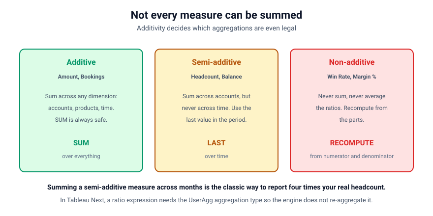
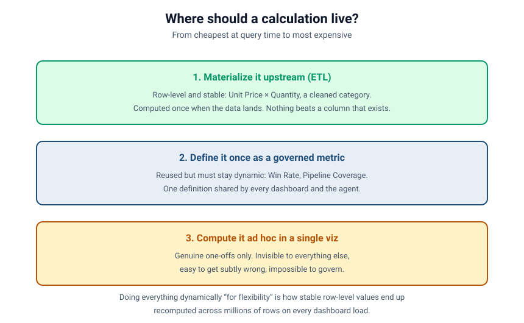

# Calculated Fields That Scale
### Part 5 of *Modeling for Answers: Data Modeling Foundations for Tableau Next*

> **Part 5 of 7** · Reading time ~13 minutes
> Every figure in this series is derived from [`data/`](data/) — run `python3 data/verify_numbers.py` to check it.
> Product specifics verified against Tableau Next, API v66.0.

---

## One calculated field brought the whole dashboard down

The model is correct now. Facts and dimensions are the right shape (Part 1), relationships are
declared with honest cardinality (Part 2), grains are respected (Part 3), and two facts conform
instead of collide (Part 4). Then someone adds a calculated field — a small one, a one-liner —
and the dashboard that loaded in two seconds now takes forty, the browser tab balloons, and on
a big org it just gives up.

Nobody changed the data. They added *one calculation*. How does a single formula do that?

Because a calculation is not free, and *where* and *when* it runs matters as much as *what* it
computes. Part 5 is about writing calculations that stay cheap as your data grows, and getting
the arithmetic right on the way.

---

## Row-level vs. aggregate: the distinction everything hinges on

There are two fundamentally different kinds of calculation, and confusing them is the root of
both wrong numbers and slow dashboards.

**A row-level calculation runs once per row, *before* aggregation.**
`Unit Price × Quantity` on each order line. `Close Date − Created Date` on each opportunity.
The engine evaluates it for every single row, then aggregates the results.

**An aggregate calculation runs *after* the rows are rolled up.**
`SUM(Amount) / COUNT(Opportunity)` — average deal size. `SUM(Won Amount) / SUM(Closed Amount)`
— win rate by value. These operate on already-summarized numbers.

Why it matters, in one line: **a row-level calc's cost scales with the number of rows; an
aggregate calc's cost scales with the number of *groups*.** A row-level calc on a
50-million-row order-line object is evaluated fifty million times. The same business answer
expressed as an aggregate might be evaluated a few hundred times — once per account, or per
month. Same answer. Radically different cost.

---

## Order of operations inside a calc: three formulas, three answers

Here's the correctness trap hiding inside the performance one. These look almost identical and
give **different answers**. Using our sample data, where won value is $400,000 and closed value
is $1,000,000:

| | Formula | What it computes | Result |
|---|---------|------------------|--------|
| ✅ | `SUM(won) / SUM(closed)` | **Ratio of sums.** Add all the won, add all the closed, divide once. | **40.0%** |
| ❌ | `SUM(won / closed)` | **Sum of ratios.** Divide on every row, then add the fractions up. | a meaningless number that can exceed 100% |
| ❌ | `AVG(won / closed)` | **Mean of ratios.** Divide on every row, then average — every deal weighted equally. | a plausible-looking wrong number |

Those two wrong answers are *different mistakes*, and it's worth separating them because they
fail differently:

- **`SUM(a/b)` is obviously broken once you look.** Summing per-row fractions produces a
  quantity with no meaning — four deals each 50% won gives 200%. People usually catch this,
  because the number is absurd.
- **`AVG(a/b)` is the dangerous one.** It returns something between 0% and 100% that looks
  entirely reasonable, and it silently weights a $10,000 deal exactly as heavily as a
  $10,000,000 one. It can be off by tens of points and nobody blinks. This is the error that
  ships.

The rule: **decide whether the numerator and denominator should be summed first or divided
first, and write the calc to match.** Ratios, rates and percentages are almost always
*aggregate* calculations — sum the parts, then divide. If you find yourself dividing on each
row and averaging, stop and ask whether you meant a ratio of sums.

### In Tableau Next: ratios need `UserAgg`, or they double-aggregate

This is a product-specific detail that bites people, and it's the same lesson wearing a
different hat.

When you create a calculated measurement whose expression *already contains* aggregation
functions, you must set its aggregation type to **`UserAgg`**:

```tableau
SUM(IF [Opportunity_TAB_Sales_Cloud].[Stage] = 'Closed Won'
    THEN [Opportunity_TAB_Sales_Cloud].[Amount] ELSE 0 END)
/
SUM(IF [Opportunity_TAB_Sales_Cloud].[Stage] = 'Closed Won'
     OR [Opportunity_TAB_Sales_Cloud].[Stage] = 'Closed Lost'
    THEN [Opportunity_TAB_Sales_Cloud].[Amount] ELSE 0 END)
```

Set that field's aggregation to `Sum` and the engine wraps another aggregation *around* an
already-aggregated expression. You've asked it to sum a ratio — exactly the `SUM(a/b)` error
above, arrived at through a configuration setting rather than a formula. `UserAgg` tells the
engine the expression handles its own aggregation and to leave it alone.

Two more conventions worth internalizing, because they're a common source of validation
errors: table fields must be **qualified** (`[Table].[Field]`), while calculated fields are
model-level and must be **unqualified** (`[Win_Rate_by_Value_clc]`). And calculated fields end
`_clc`, metrics end `_mtc`, with no double underscores anywhere.

---

## Sidebar: some measures cannot be summed at all

Additivity is the property that decides which aggregations are even *legal* on a measure, and
it splits measures into three classes.



**Additive.** `Opportunity.Amount`, `Order.Amount`, quantities. Sum across any dimension you
like — accounts, products, months — and the answer is meaningful. Most of what you model is
additive, which is why the other two classes catch people out.

**Semi-additive.** Headcount, account balance, inventory on hand, pipeline snapshot. These sum
correctly across *some* dimensions and not across **time**. Ten people in Sales plus eight in
Support is eighteen people. But January's eighteen plus February's eighteen is not thirty-six
people — it's the same eighteen counted twice. For a semi-additive measure, the right
aggregation over time is usually the **last value in the period**, not the sum.

This is the classic way an organization reports four times its real headcount: put a
semi-additive measure in a view with a quarter on it and let the default `SUM` do its work.

**Non-additive.** Every ratio, rate and percentage — win rate, margin percent, pipeline
coverage. You can never sum these and you must not average them. The only correct treatment is
to **recompute from the numerator and denominator at the level you're displaying**, which is
precisely why they have to be aggregate calculations and why they need `UserAgg`.

The practical instruction: for every measure in your model, write down which class it's in. It
takes ten minutes and it prevents a category of bug that's very hard to spot after the fact,
because the wrong number always looks like a plausible number.

---

## The cost of hops: calculations that reach across relationships

Now combine calculations with everything from Parts 2, 3 and 4.

A calculation that references fields from a **single object** is cheap — the engine already has
those columns in hand. But a calculation that references fields from **several related
objects** forces the query to *traverse those relationships* to gather its inputs — and if any
of those hops is a one-to-many, you've now invited fan-out into your formula.

The expensive pattern, specifically:

> A **row-level** calculation, living on a **high-cardinality leaf object** far from the fact,
> that **reaches back across several relationship hops** to pull in fields.

Every one of those is a cost multiplier, and stacking them is how one field kills a dashboard:

- **Row-level** → evaluated once per row.
- **On a high-cardinality leaf object** → an enormous number of rows to evaluate.
- **Reaching across hops** → forces relationship traversal on every one of those rows (Part 2).
- **Across a one-to-many hop** → fan-out inflates both the cost and possibly the answer (Part 3).

This is why "just one small calc" can change everything: the formula is small, but the *work*
it triggers is the product of all four factors.

### How to actually find the culprit

"Something got slow" is not a diagnosis. A workable sequence:

1. **Bisect the view.** Remove fields one at a time and reload. The field whose removal
   restores performance is your suspect. Crude, fast, almost always conclusive.
2. **Count the rows the query is really touching.** Put `COUNTD` of the fact's primary key next
   to the raw row count. If they diverge, you have fan-out inflating the work.
3. **Read the calc for hops.** Count the distinct objects referenced in the expression.
   More than one means traversal; more than two deserves justification.
4. **Ask whether it must be dynamic.** This is the question that resolves most cases, and it
   leads straight into the next section.

---

## Where should a calculation live? A cost hierarchy

When you need a calculated value, you almost always have a choice about *where* it's computed.
From cheapest-at-query-time to most expensive:



1. **Materialize it upstream (ETL / the builder).** If the value is **row-level and stable** —
   `Unit Price × Quantity`, a cleaned category, a fiscal-period tag, a currency conversion —
   compute it once, when the data lands, and store it as a real column. This is the *builder's*
   job (remember Part 1: architect vs. builder). Nothing at query time beats a column that
   already exists.
2. **Define it once as a governed calculated field / metric in the model.** For values that
   must stay dynamic but are reused everywhere — win rate, average deal size, pipeline coverage
   — define them **once** in the semantic layer so every dashboard and the agent share one
   correct definition. (This also becomes the agent's vocabulary — Part 7.)
3. **Compute it ad hoc in a single viz.** Fine for genuine one-offs. But an ad-hoc calc is
   invisible to everything else, easy to get subtly wrong, and impossible to govern. If you
   find the same ad-hoc calc in five dashboards, it wanted to be #2.

The instinct many teams have — do *everything* dynamically at query time because it's flexible
— is exactly how you end up recomputing stable, row-level values across millions of rows on
every single dashboard load. Push stable row-level work down to the builder. Reserve query-time
calculation for what genuinely must be dynamic.

---

## A note for Salesforce data specifically

- **Formula fields and roll-up summaries already did work upstream.** A Salesforce roll-up
  summary is a pre-aggregated value. Re-aggregating it in the semantic layer can double-apply a
  relationship (Part 2) — know whether a field is already rolled up before you `SUM` it again.
- **Currency and multi-currency.** If amounts live in different currencies, a naive
  `SUM(Amount)` adds pesos to dollars. Currency conversion is a row-level normalization that
  almost always belongs upstream, with the builder, not in an ad-hoc viz calc.
- **Cross-object formula fields hide hops.** A Salesforce formula that pulls
  `Account.Industry` onto the Opportunity has *already* crossed a relationship. It looks like a
  local field but carries a hop's cost and can mask cardinality assumptions.

---

## Seeing it in a Tableau Next semantic data model

Take our conformed Opportunities-and-Orders model. We want **line-level margin** on order
lines, and a governed **win rate**.

- **Margin** (`Line Revenue − Line Cost`) is **row-level and stable** → materialize it on the
  order-line object upstream. Don't make every dashboard recompute it across every line.
- **Win rate** is a **reused, non-additive ratio that must stay dynamic** → define it once as a
  governed aggregate metric with `UserAgg`.

And here we make a decision this series previously fudged. There is no single "win rate."
There are two honest ones, so we publish **both, named**:

| API name | Expression shape | Result |
|----------|------------------|--------|
| `Win_Rate_by_Value_clc` | `SUM(won amount) / SUM(closed amount)` | 40.0% |
| `Win_Rate_by_Count_clc` | `COUNT(won opps) / COUNT(closed opps)` | 50.0% |

Both are correct. They answer different questions — "what share of the money did we win" and
"what share of the deals did we win" — and an organization that sells a few large deals
alongside many small ones will see them diverge sharply. Naming both, and declaring one the
house default, is the governance move. Part 6 shows what happens when you don't.

> **Screenshot needed** — the SDM calculated-field editor showing `Win_Rate_by_Value_clc` with
> its expression and its `UserAgg` aggregation type, alongside `Margin` as a materialized
> column on the order-line object. This is a product panel, so capture it from your own org; a
> drawn schematic would misrepresent the UI.

Note what we avoided: a **row-level** margin calc defined **on the order-line leaf** that
reaches back up to the Opportunity header — the exact four-factor cost bomb from above.

---

## The failure, live

1. **Build the bomb.** Add a row-level calculated field on the order-line object that reaches
   across two hops (line → order → account) to pull a header value, and put it in a big viz.
   Watch load time and memory climb; on a large org, watch it stall.
2. **Show the ratio errors side by side.** Display win rate three ways —
   `SUM(won)/SUM(closed)` at 40.0%, `AVG(won/closed)`, and `SUM(won/closed)`. Let the room see
   the first is right, the second is plausible and wrong, and the third is nonsense.
3. **Show the `UserAgg` trap.** Take the correct expression, flip its aggregation type from
   `UserAgg` to `Sum`, and watch a correct formula start returning a wrong number without a
   single character of the formula changing.
4. **Sum a semi-additive measure across quarters** and watch headcount quadruple.
5. **Fix them all.** Materialize the stable row-level piece upstream; redefine the ratios as
   governed aggregate metrics with `UserAgg`; set the semi-additive measure to last-value.
   Dashboard snaps back to fast; the numbers snap back to correct.

Same question. The difference was *where* and *when* the math ran.

---

## Takeaways: calculations that scale

1. **Know whether you're writing a row-level or an aggregate calc.** Row-level cost scales with
   *rows*; aggregate cost scales with *groups*. Prefer aggregate for anything you're rolling up.
2. **Ratios are aggregate calcs.** `SUM(a)/SUM(b)`. `SUM(a/b)` is nonsense; `AVG(a/b)` is
   plausible nonsense, which is worse.
3. **In Tableau Next, an expression containing `SUM` needs `UserAgg`.** Otherwise the engine
   aggregates your aggregate and the formula lies.
4. **Classify every measure as additive, semi-additive or non-additive.** Semi-additive
   measures must not be summed over time; non-additive ones must be recomputed, never summed.
5. **Every relationship hop in a calc has a cost** — and a one-to-many hop invites fan-out.
   Beware row-level calcs on leaf objects that reach back across the model.
6. **Push stable, row-level work down to the builder (ETL).** Materialize it once; don't
   recompute it on every load.
7. **Define reused calcs once, in the model, as governed metrics** — and when a metric has two
   legitimate definitions, publish both with distinct names rather than picking silently.

Practice questions for this part are in
[`reference/exercises.md`](reference/exercises.md).

---

## Coming next

**[Part 6 — Order of Operations & Context in the Viz Layer](session-6-order-of-operations-and-context.md).**
Even with a correct model and well-placed calculations, the *same field* can show *different
numbers* on two dashboards — and both can be right. We'll walk the exact order of operations,
show one field name producing four defensible answers from the same data, and pin down what
"add to context" actually decides.

*Ever had a calc that was mathematically fine but crushed performance? We want that example for
the webinar.*
