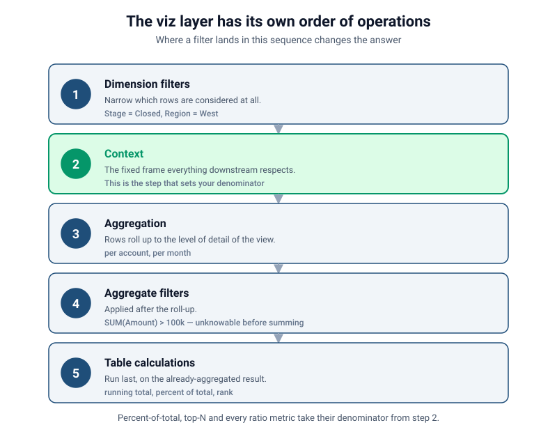
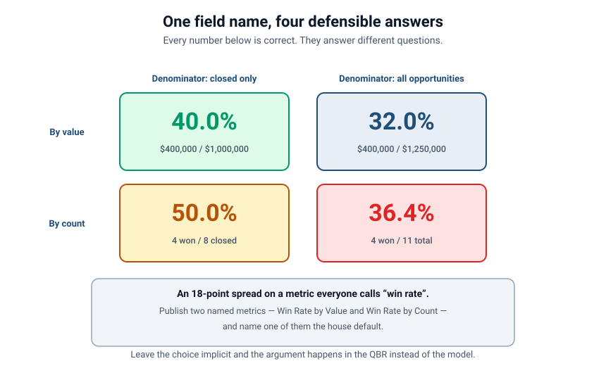

# Order of Operations & Context in the Viz Layer
### Part 6 of *Modeling for Answers: Data Modeling Foundations for Tableau Next*

> **Part 6 of 7** · Reading time ~13 minutes
> Every figure in this series is derived from [`data/`](data/) — run `python3 data/verify_numbers.py` to check it.
> Product specifics verified against Tableau Next, API v66.0.

---

## Two dashboards. Same field. Different numbers. Both right.

You've done everything right. The model has the correct shape (Part 1), honest relationships
(Part 2), respected grains (Part 3), conformed facts (Part 4), and well-placed calculations
(Part 5).

Then two people build a dashboard using the *same* governed win-rate field, and one shows
**40%** while the other shows **32%**. Nobody made a mistake. Neither number is a bug. The
model is fine.

That's the hardest kind of problem, because there's nothing to fix — there's only something to
*understand*. The viz layer has its own **order of operations**, and *where a filter lands in
that sequence* changes the answer. Part 6 is about making that sequence explicit, so
"different numbers" becomes a decision you control rather than a surprise you discover in a
meeting.

---

## The sequence that decides your answer

Most people picture a query as one step: "get the data that matches, then compute." It's a
pipeline, and the stages run in a fixed order.



The essential sequence, in the order it runs:

1. **Dimension filters** — narrow *which rows* are considered at all. `Stage = Closed`,
   `Region = West`. (This is the stage that silently no-ops when the query never visits the
   object — Part 2.)
2. **Context** — the fixed frame of reference everything downstream respects. **This is the
   stage that sets your denominator.**
3. **Aggregation** — rows roll up to the level of detail of the view. `SUM`, `COUNT`, `AVG`,
   per account, per month, per whatever is on the shelf.
4. **Aggregate (measure) filters** — applied *after* the roll-up, because they can't be
   evaluated before it. `SUM(Amount) > 100000` is unknowable until you've summed.
5. **Table calculations** — run *last*, on the already-aggregated result. Running total,
   percent of total, rank, difference from previous.

The consequences fall straight out of the ordering:

- A **dimension filter** removes rows before anything is summed, so it changes the inputs to
  every later stage.
- An **aggregate filter** can only hide rows *after* summing — so a grand total may not equal
  the sum of the rows you can see. That's not a bug; the total was computed at stage 3 and the
  filter ran at stage 4.
- A **table calculation** only ever sees what survived stages 1–4. A percent-of-total on a
  filtered view is a percent of the *filtered* total, not the real one.

### The precise version, and why `FIXED` is the giveaway

The five stages above are the mental model. The documented pipeline in Tableau — which the viz
layer inherits — is finer-grained, and one detail in it is worth knowing exactly:

1. Extract filters
2. Data source filters
3. **Context filters**
4. **`FIXED` level-of-detail expressions**
5. **Dimension filters**
6. `INCLUDE` / `EXCLUDE` level-of-detail expressions
7. Measure (aggregate) filters
8. Forecasts
9. **Table calculations**
10. Table-calculation filters
11. Trend and reference lines
12. Totals

Look at stages 3, 4 and 5. A **`FIXED` expression is computed *after* context filters but
*before* dimension filters.** That single ordering fact explains a behavior that otherwise
looks arbitrary:

> A `FIXED` calculation **ignores** an ordinary dimension filter, but **respects** the same
> filter once you promote it to context.

So if you have `{ FIXED [Account] : SUM([Amount]) }` and you filter to the West region, the
FIXED value doesn't budge — it was already computed. Promote that filter to context and the
FIXED value recomputes on the narrowed data. Nothing changed except *which stage the filter ran
in*.

This is the mechanism behind "add to context." It isn't a performance hint or a nice-to-have.
It moves your filter from stage 5 to stage 3, in front of the level-of-detail calculations and
in front of everything that derives a denominator.

Platforms differ in the details of this pipeline, so treat the twelve-stage list as Tableau's
documented order rather than a universal law. The *shape* of it — filter, frame, aggregate,
filter again, then table calcs — is common to every tool worth using.

---

## Context is a denominator decision

"Add to context" sounds like a performance tweak. It's a **semantic** choice, and it's usually
the answer to "why do these two numbers differ."

Context answers: **relative to what?**

- **Percent of total** — percent of *which* total? The whole company, the filtered region, or
  the visible rows?
- **Top N** — the top 10 accounts overall, or the top 10 *within each region*?
- **Any ratio** — including every rate and percentage metric you own.

Same data, same formula, different context, different answer. And because context sits at stage
3 — ahead of aggregation and ahead of level-of-detail expressions — it decides the frame that
everything downstream is measured against.

---

## One field name, four defensible answers

Here is the 40%-versus-32% mystery, resolved — and it turns out to be worse than two numbers.

"Win rate" contains two unstated choices:

- **What are we counting** — value (money) or count (deals)?
- **What's the denominator** — all opportunities, or only closed ones?

Two binary choices, four combinations, and our sample data gives all four:



| | Denominator: closed only | Denominator: all opportunities |
|---|---|---|
| **By value** | **40.0%** ($400,000 / $1,000,000) | **32.0%** ($400,000 / $1,250,000) |
| **By count** | **50.0%** (4 won / 8 closed) | **36.4%** (4 won / 11 total) |

Every one of those four numbers is correct. They answer four different questions:

- **40.0%** — of the money we finished competing for, we won this share. The honest measure of
  competitive performance.
- **32.0%** — of all the money we've ever put in the pipeline, we've booked this share.
  Depresses the number by counting deals that haven't been decided yet as not-won.
- **50.0%** — of the deals we finished, we won half. Ignores that our wins might be small and
  our losses large.
- **36.4%** — of every deal we've opened, we've won this share.

An **18-point spread** on a metric everyone in the building calls "win rate." Two analysts, two
defensible readings, and a meeting that becomes an argument about arithmetic instead of a
decision about the business.

Notice the by-value/by-count split is the one we named in Part 5 — `Win_Rate_by_Value_clc` and
`Win_Rate_by_Count_clc`. The closed-only/all-opportunities split is *context*: it's the
denominator, decided at stage 3 by which rows are in frame.

### The fix is governance, not cleverness

Don't leave any of the four choices implicit:

1. **Name the measure basis.** Publish `Win Rate by Value` and `Win Rate by Count` as two
   distinct governed metrics. They are two metrics; giving them one name is the original sin.
2. **Bake the intended denominator into the definition.** If the house definition is over
   closed opportunities, put that constraint *inside* the metric — don't rely on every analyst
   remembering to filter to `Closed` and to promote that filter to context.
3. **Name one the default.** When someone says "win rate" with no qualifier, exactly one number
   should come back. Write down which.
4. **Say it in the description.** "Win Rate by Value: won amount ÷ closed amount. Excludes open
   opportunities. House default." Now the definition travels with the number — to every
   dashboard, and to the agent in Part 7.

> **Screenshot needed** — the governed metric definition panel showing `Win_Rate_by_Value_clc`
> with its description text and the closed-opportunity constraint baked in. This is a product
> panel; capture it from your own org rather than approximating it.

---

## Level of detail: when the view and the question disagree

The other half of context problems is **level of detail** — the granularity at which a
calculation is evaluated versus the granularity of what's on screen.

A view showing one row per **account** but a calculation that needs to reason at the
**opportunity** level is a level-of-detail mismatch. Symptoms:

- Numbers that look right per row but wrong in total (or the reverse).
- A grand total that isn't the sum of the visible rows.
- Percentages that don't add to 100%.
- A value that changes when you add a field that shouldn't have affected it.

The last one is the tell. **If adding a dimension to the view changes a number that logically
shouldn't depend on it, you have a level-of-detail problem**, because that number is being
recomputed at the view's granularity rather than the one you intended.

The instrument for this is the level-of-detail expression, which lets you pin a calculation to a
granularity independent of the view:

```tableau
{ FIXED [Opportunity_TAB_Sales_Cloud].[Account_Id] : SUM([Opportunity_TAB_Sales_Cloud].[Amount]) }
```

That computes total amount per account *regardless* of what else is on the shelf — so you can
show account-level totals next to opportunity-level rows, or build a percent-of-account-total
that doesn't shift when you drill in. And now you know exactly when it will and won't respond
to a filter: it runs at stage 4, so ordinary dimension filters don't reach it and context
filters do.

---

## Seeing it in a Tableau Next semantic data model

Take our conformed model and build the two dashboards deliberately.

- **Dashboard A** — "Sales Performance." Win Rate by Value, with `Stage` filtered to closed
  and that filter **promoted to context**. Reads **40.0%**.
- **Dashboard B** — "Pipeline Health." The same governed field, no stage filter, because this
  dashboard is about everything in flight. Reads **32.0%**.

Both are correct. Both are useful. Neither is a bug. And an executive who sees them side by
side has no way to tell why they differ — which is a governance failure, not a modeling one.

Then add the top-N demonstration, because it's the fastest way to make context click:

- Top 5 accounts by pipeline, `Region` filter as an **ordinary dimension filter** → the top 5
  are chosen from within the West.
- Same view, `Region` **promoted to context** → the top 5 are chosen from all accounts, then
  displayed for the West. You may see fewer than five rows.

Same filter. Same fields. Different stage. Different answer.

---

## The failure, live

1. **Show the two dashboards.** 40.0% and 32.0%, same governed field, side by side. Ask which
   one is broken. (Neither.)
2. **Reveal the denominator.** Expose the stage filter on A and its absence on B. The
   difference was never the metric; it was which rows were in frame.
3. **Escalate to four.** Add the by-count versions: 50.0% and 36.4%. One field name, four
   right answers, an 18-point spread.
4. **Demonstrate context with top-N.** Region as a dimension filter, then as a context filter.
   Watch the membership of the top 5 change.
5. **Demonstrate the `FIXED` ordering.** Put a `FIXED` account-total on screen, apply a
   dimension filter — it doesn't move. Promote the same filter to context — it recomputes.
6. **Fix by governance.** Publish two named metrics, bake the denominator into the definition,
   declare one the default, and write it in the description.

---

## Takeaways: controlling the frame

1. **Know the pipeline: dimension filters → context → aggregation → aggregate filters → table
   calcs.** Where a filter lands changes the answer.
2. **`FIXED` runs after context filters but before dimension filters.** That is the whole
   explanation of "add to context," and it's worth memorizing.
3. **Aggregate filters run after aggregation,** so a grand total needn't match the visible rows.
   Not a bug — an ordering consequence.
4. **Table calcs run last** and only see what survived. Percent-of-total on a filtered view is a
   percent of the filtered total.
5. **Context is a denominator decision, not a performance setting.** Every ratio, percent of
   total, and top-N depends on it.
6. **If adding a field changes a number that shouldn't depend on it,** you have a level-of-detail
   problem. Pin the calculation with a `FIXED` expression.
7. **A metric with two legitimate definitions needs two names.** Bake the intended denominator
   into each, declare a house default, and put it in the description.

Practice questions for this part are in
[`reference/exercises.md`](reference/exercises.md).

---

## Coming next

**[Part 7 — Modeling for the Agent](session-7-modeling-for-the-agent.md).** Everything so far has
been about getting the model right for *people*. Now the consumer is an AI agent, and it has no
intuition to fall back on — it can't tell that "ACV" and "Amount" mean different things, or
that "this year" means fiscal in your company. We'll cover the metadata that makes a model
answerable, how to standardize without overfitting, and how to actually *evaluate* whether your
agent is getting the right answers.

*Ever had two dashboards disagree and spent a week proving both were right? That's the story we
want.*
