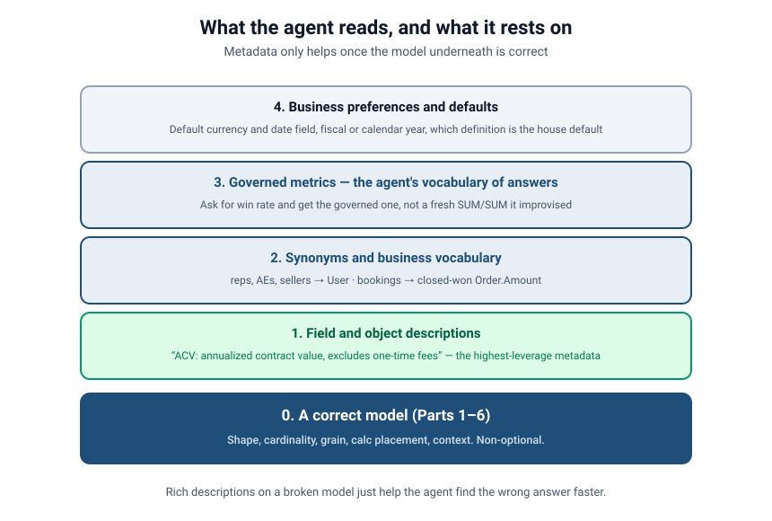
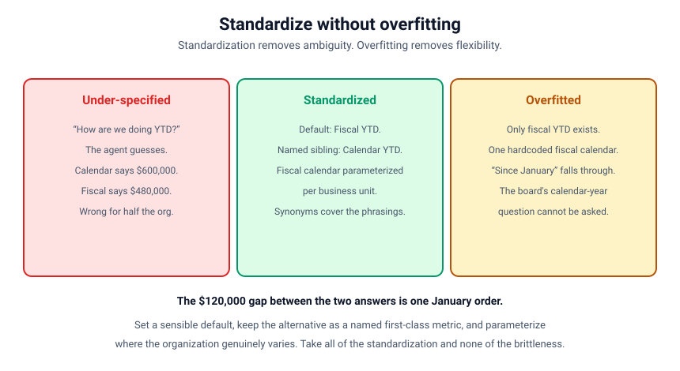

# Modeling for the Agent
### Part 7 of *Modeling for Answers: Data Modeling Foundations for Tableau Next*

> **Part 7 of 7** · Reading time ~14 minutes
> Every figure in this series is derived from [`data/`](data/) — run `python3 data/verify_numbers.py` to check it.
> Product specifics verified against Tableau Next, API v66.0.

---

## The agent doesn't know what you meant

Six parts in, your model is genuinely good. The shape is right, relationships are honest,
grains are respected, two facts conform instead of colliding, calculations are placed well, and
context is governed.

Now the consumer changes. Instead of an analyst who knows that "ACV" means annualized contract
value and that "this year" means the fiscal year starting in February, the consumer is an **AI
agent** answering a question typed in plain language by someone who has never opened your model.

The agent has no institutional memory. It can't ask a colleague. It can't tell from a field
name whether `Amount` or `Expected_Revenue` is what your company calls pipeline. It reads what
you gave it, makes the most reasonable inference available, and answers with complete
confidence.

That last part is what makes this different from every previous part of the series. A human who
doesn't understand your model gets *confused* and asks a question. An agent that doesn't
understand your model gets *confident* and gives an answer.

---

## Metadata isn't documentation. It's the interface.

The instinct is to treat field descriptions as documentation — nice to have, written last,
skipped when there's no time. For an agent, **metadata is the primary interface.** It's not
commentary on the model; it's the part of the model the agent actually reads.

Four layers, in the order they pay off — and all of them resting on something non-optional.

### 1. Descriptions on objects and fields

The highest-leverage metadata you can write, and the most commonly empty.

A field called `ACV` is meaningless to an agent. `ACV — annualized contract value; excludes
one-time fees and professional services` is actionable. The same for objects: `Orders — one row
per confirmed customer order; represents actual bookings, not pipeline` tells an agent both what
the object *is* and what it *isn't*.

Write descriptions that answer the questions a new analyst would ask on their first day:

- What is this, in a business sense?
- What does it include and exclude?
- What is one row? (Your grain sentence from Part 3 — put it here.)
- When would I use this instead of that similar-looking field?

That last one matters more than it looks. Most agent errors aren't "it didn't know what a field
was." They're "it couldn't tell which of two similar fields you meant." Descriptions that
explicitly *contrast* — `Amount: total contract value. For annualized value use ACV` — resolve
exactly the ambiguity a flat wide table creates (Part 1).

### 2. Synonyms and business vocabulary

Your users don't speak your schema. They say "reps," "AEs," and "sellers"; your model says
`User`. They say "deals" and "opps"; your model says `Opportunity`. They say "bookings"; your
model has an `Order` object with an `Amount` field and a status.

Every one of those is a mapping the agent has to make, and every mapping it has to *guess* is a
chance to be confidently wrong. Synonyms are how you stop it guessing. Harvest them from real
sources rather than inventing them: the words in your Slack channels, the labels on the reports
people actually use, the phrases in the questions your BI team gets asked.

### 3. Governed metrics — the agent's vocabulary of answers

This is where Parts 5 and 6 pay off directly.

If "win rate" exists as a **governed metric** with its basis and denominator baked in, then a
question about win rate resolves to *that definition*. If it doesn't, the agent will improvise
a plausible `SUM/SUM` — and as Part 6 showed, there are four defensible answers spanning 18
points. The agent will pick one. It won't tell you which, or that a choice was made at all.

Governed metrics turn an open-ended generation problem into a lookup. That's a much better
problem: lookups are testable.

### 4. Business preferences and defaults

The organizational conventions nobody writes down because everyone "just knows" them:

- Default currency, and what to do with multi-currency data.
- Fiscal year vs. calendar year — and which one "this year" means.
- The default date field for a given fact (Part 2's role-playing dimensions: close date for
  bookings, created date for pipeline generation).
- Which of two competing definitions is the house default.

An agent with no default guesses. An agent with a stated default is right by construction.

### 0. Underneath all of it: a correct model

The layer that isn't optional. Rich descriptions on a model with wrong cardinality, mixed
grains, or an inner join where a full outer join belonged will just help the agent find the wrong
answer faster — and explain it more persuasively.

**Metadata amplifies your model. It does not repair it.**

---

## What "this year" costs you: the YTD trap

Here's the concrete version, with numbers from our sample data.

Someone asks the agent: *"How are we doing this year?"*

Our fiscal year starts **1 February**. So as of 25 August 2026:

| Reading | Window | Bookings |
|---------|--------|----------|
| Calendar year to date | 1 Jan – 25 Aug 2026 | **$600,000** |
| Fiscal year to date | 1 Feb – 25 Aug 2026 | **$480,000** |

A **$120,000 gap — 20% of the number** — and the entire difference is one order: **R-006**, Delta
Foods' $120,000 order placed on 20 January 2026. It's inside the calendar year and outside the
fiscal one.

Nothing here is a modeling error. Both windows are legitimate. But if the agent isn't told
which one your company means, it picks — and it will be wrong for half the organization, with
no indication that a choice was made.

This is what a business preference *is*: not documentation, but the difference between $600,000
and $480,000 on a number someone is about to act on.

---

## Standardize, but don't overfit

Standardization removes ambiguity. Overfitting removes flexibility. Both failure modes are
real, and teams usually swing hard from one to the other.

**Under-specified** is where most models start. "This year" is undefined, so the agent guesses
between $600,000 and $480,000. Every ambiguity is a coin flip, and the answers are unreliable in
a way that's hard to even detect, because each individual answer looks fine.

**Overfitted** is the overcorrection. Someone gets burned by the YTD problem and hardcodes it:
only fiscal YTD exists, one fiscal calendar for the whole company, and the metric is written so
narrowly that nothing else can be expressed. Now:

- "How did we do since January?" falls through — the model can't answer it at all.
- The board, which thinks in calendar years, cannot ask its own question.
- The business unit whose fiscal year starts in October gets silently wrong answers.
- A new question needs a schema change instead of a query.

**Standardized with escape hatches** is the target:

- **Set a sensible default.** Fiscal YTD is the house answer for "this year." Bare questions get
  a consistent, documented answer.
- **Keep alternatives as first-class named metrics.** `Bookings Calendar YTD` exists alongside
  `Bookings Fiscal YTD`. Both are real; neither is a workaround. This is exactly the
  `Win_Rate_by_Value` / `Win_Rate_by_Count` pattern from Part 5, applied to time.
- **Parameterize where the organization genuinely varies.** If fiscal calendars differ by
  business unit, that belongs in the date dimension as data (Part 1's sidebar), not hardcoded in
  a metric.
- **Cover the phrasings with synonyms** so "YTD," "this year," "year to date" and "since the
  start of the year" all land somewhere sensible — and note that the last one is genuinely
  ambiguous and should probably resolve to calendar.

That combination gets you the standardization without the brittleness.

---

## Guardrails: the model as a contract

Metadata tells the agent what things mean. **Guardrails** constrain what it's allowed to do.
Both are part of modeling.

- **Declared cardinality** (Part 2) stops the agent generating a query that fans out.
- **Declared grain** (Part 3) stops it summing a header amount across line items.
- **Governed metrics** (Part 5) stop it inventing a fifth win rate.
- **Baked-in context** (Part 6) stops it silently changing your denominator.
- **Allocation factors on bridges** (Part 4) stop "revenue by product" exceeding total revenue.

Every one of those is a structural constraint that makes a category of wrong answer
*unreachable* rather than merely unlikely. That's the difference between hoping the agent behaves
and building a model in which misbehaving isn't an available move.

Which is the real argument of this whole series: **a well-modeled semantic layer is a contract
that makes wrong answers structurally hard to produce.**

---

## How do you know it's working? Build an eval set.

Here's the part most teams skip, and it's the part that turns all of the above from faith into
engineering.

You cannot tell whether your metadata is good by reading it. You find out by **asking the agent
questions whose answers you already know** and checking whether it gets them right. That's an
**evaluation set** — a golden question set — and it's the single highest-value artifact you can
build after the model itself.

The format is unglamorous on purpose. Ten of this model's twenty questions, keeping the numbering
they carry in the eval set itself:

| Eval # | Question as a user would type it | Expected answer | Tests |
|---|---|---|---|
| 1 | What's my open pipeline? | $250,000 | Correct fact, correct stage filter |
| 3 | Show me pipeline by rep | 2 owners ($175,000 / $75,000) | "rep" → User synonym |
| 4 | Pipeline for Acme | $100,000 | Synonym → account, open-only |
| 5 | What's the amount for the Acme Platform Expansion deal? | $100,000, not $300,000 | Fan-out protection |
| 6 | Revenue by product | totals to $600,000, never more | Allocation factor on the bridge |
| 9 | What's our win rate? | 40.0% (house default, by value, closed only) | Governed metric resolution |
| 11 | How many deals did we win? | 4 | Count vs. value basis |
| 13 | How are we doing this year? | $480,000 (fiscal YTD, the house default) | Fiscal-vs-calendar default |
| 16 | Bookings for Granite Bank | $55,000 | Account present in only one fact |
| 18 | How's Helios Energy doing? | No opportunities and no orders — said plainly | Absence reported, not rendered as zero |

The numbers in that first column are the point: they are the eval set's own identifiers, so
"question 13 regressed" means the same thing in a standup, a commit message and the file. All
twenty, with the exact expected values and the specific failure each one is designed to catch,
are in [`Semantic Models/agent-eval-set.md`](Semantic%20Models/agent-eval-set.md).

Four principles that make an eval set actually useful:

1. **Score the number, not the prose.** A confidently-worded wrong answer is a failure. Assert
   the value.
2. **Include the questions you know are ambiguous.** Question 13 exists precisely because "this
   year" has two answers. You're testing that the agent applies your *stated default*, not that
   it reads your mind.
3. **Write a question for every trap in this series.** Fan-out, chasm trap, allocation,
   denominator, YTD, synonyms. If a question in your eval set fails, you know which part to go
   back to.
4. **Re-run it whenever anything changes** — the model, the metadata, the underlying data, or the
   platform. This is a regression suite, and its value is almost entirely in being run again.

When a question fails, the fix is nearly always in one of four places, in this order: the model
is wrong (go back to Parts 1–4), the metric isn't governed (Part 5), the context isn't baked in
(Part 6), or the metadata is missing (this part). Notice that "the agent is bad" isn't on the
list.

---

## Seeing it in a Tableau Next semantic data model

Take the conformed Opportunities-and-Orders model and instrument it properly:

- **Descriptions everywhere.** Objects state their grain: `Orders — one row per confirmed
  customer order; actual bookings, not pipeline`. Fields state their business meaning and their
  contrast: `Amount — total opportunity value in company currency; for annualized value see ACV`.
- **Synonyms** mapping `reps`/`AEs`/`sellers` → `User`, `deals`/`opps` → `Opportunity`,
  `bookings` → closed-won `Order.Amount`.
- **Governed metrics** for `Win_Rate_by_Value_clc` and `Win_Rate_by_Count_clc`, each with its
  denominator baked in, one declared the default.
- **Business preferences**: fiscal year starts 1 February; `Close_Date` is the default date for
  bookings, `Created_Date` for pipeline generation; company currency is USD.
- **An eval set** of the ten questions above, run after every change.

> **Screenshot needed** — the semantic metadata panel showing populated object and field
> descriptions, the synonym list, and the business-preferences section. This is a product panel;
> capture it from your own org rather than approximating it.

Then ask the vaguest question you can: *"How are we doing this year?"* A well-instrumented model
returns $480,000, states that it used fiscal year to date, and offers the calendar-year figure
as an alternative. That last behavior — **naming the choice it made** — is the difference
between an answer you can act on and one you have to go verify.

---

## The failure, live

1. **Strip the metadata.** Same correct model, empty descriptions, no synonyms, no governed
   metrics, no stated fiscal default. Ask "how are we doing this year?" and "what's our win
   rate?" Get plausible, unattributed numbers.
2. **Run the eval set against it.** Watch it fail on questions 3, 6, 9, 11 and 13 — the five that
   depend on a synonym, an allocation factor, a governed metric, a count basis and a stated fiscal
   default. Not vaguely, but specifically, with a wrong number next to a right one.
3. **Add metadata layer by layer.** Descriptions, then synonyms, then governed metrics, then the
   fiscal default. Re-run the eval set after each layer and watch the pass rate climb. This is
   the most persuasive demo in the entire series, because it's a number going up.
4. **Then show overfitting.** Hardcode fiscal YTD as the only option, ask "how did we do since
   January?", and watch a reasonable question become unanswerable.
5. **Land on the balance.** Default plus named alternatives plus parameterized calendars.
   All questions answerable, none ambiguous.

---

## Takeaways: making a model answerable

1. **Metadata is the interface, not documentation.** For an agent, the description *is* the
   field.
2. **Descriptions first — they're the highest-leverage thing you can write.** State business
   meaning, inclusions and exclusions, the grain, and the contrast with similar fields.
3. **Synonyms bridge business language and schema.** Harvest them from how people actually ask.
4. **Governed metrics are the agent's vocabulary of answers.** Without them it improvises, and
   Part 6 showed how far apart the improvisations can be.
5. **State your defaults** — currency, fiscal calendar, default date field, house definition.
   An agent with no default guesses.
6. **Standardize with escape hatches.** Sensible default, alternatives as named first-class
   metrics, parameterize where the business genuinely varies.
7. **Guardrails are modeling.** Cardinality, grain, governed metrics and baked-in context make
   whole categories of wrong answer unreachable.
8. **Build an eval set and re-run it.** You cannot assess metadata by reading it. Score the
   numbers.
9. **Metadata amplifies a good model and cannot rescue a bad one.** Parts 1–6 are the
   prerequisite.

---

## Where this leaves you

Seven parts, one idea: **the shape of your data determines the quality of your answers.**

- **Part 1** — facts and dimensions, and modeling as architecture rather than construction.
- **Part 2** — relationships as doors, and why an economical query made your filter a no-op.
- **Part 3** — grain, fan-out, and the chasm trap that inflates two facts by different factors
  while deleting the interesting rows.
- **Part 4** — conformed dimensions, drill-across with a full outer join, junctions, allocation,
  and the whitespace payoff.
- **Part 5** — calculations that scale, ratios that don't lie, and measures you're not allowed
  to sum.
- **Part 6** — order of operations, context as a denominator decision, and one field name with
  four right answers.
- **Part 7** — the metadata that makes it answerable, and the eval set that proves it.

None of it is exotic. It's the discipline of deciding what your data *means* before asking a
tool to interpret it — and writing those decisions down where both people and agents can read
them.

The dashboards get faster. The numbers stop being arguable. And when you point an agent at it,
you get answers you can actually act on.

**Model like an architect. Then write the blueprint down.**

---

Reference material for the whole series:
[glossary](reference/glossary.md) ·
[symptom triage](reference/symptom-triage.md) ·
[exercises](reference/exercises.md) ·
[going deeper](reference/going-deeper.md)

*That's the series. If you've got a modeling war story — the number that doubled, the filter
that did nothing, the agent that confidently made something up — we want to hear it.*
